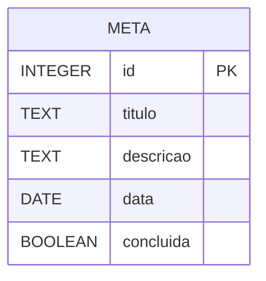

# CanDo

## Sobre o app

O **CanDo** é um aplicativo de metas diárias, onde o usuário cadastra as metas que deseja cumprir no dia e pode acompanhá-las ao longo do dia. Além do controle básico de metas, o app pretende trazer funcionalidades para tornar o cumprimento das tarefas mais dinâmico e motivador, como cronômetro, timer regressivo e sorteio de tarefas.

### Funcionalidades essenciais

- [ ] Criar meta do dia
- [ ] Listar/visualizar metas do dia
- [ ] Editar meta
- [ ] Marcar meta como concluída
- [ ] Apagar meta

### Funcionalidades adicionais (trabalhos futuros)

- [ ] Cronômetro para medir o tempo gasto em cada tarefa
- [ ] Timer regressivo para cumprir a tarefa dentro de um prazo
- [ ] Sorteio de tarefas do dia ("roleta" de metas)

## Protótipos de tela

[Protótipos - CanDo (Figma)](https://www.figma.com/design/LBz7bRwmiWOFjMUBxhAk5m/CanDo?node-id=0-1&t=MYgJB43Y0SSDIezh-1)

## Modelagem do banco

O aplicativo utilizará um banco de dados local **SQLite** para armazenar as metas cadastradas pelo usuário.

### Tabela `META`

A tabela `META` armazenará as informações necessárias para criação, visualização e gerenciamento das metas diárias.

## Planejamento de sprints

O desenvolvimento do **CanDo** será dividido em 8 sprints, com duração estimada de uma semana cada. O planejamento contempla as etapas de planejamento, prototipação, modelagem do banco de dados, desenvolvimento das funcionalidades, testes e finalização do aplicativo.

### Sprint 1 — Planejamento e prototipação

**Duração:** 1 semana

* [ ] Definir as funcionalidades essenciais do aplicativo
* [ ] Definir o fluxo de navegação
* [ ] Criar as telas principais no Figma
* [ ] Criar o protótipo interativo
* [ ] Revisar a experiência de navegação

**Resultado esperado:** protótipo das principais telas e fluxos do CanDo finalizado.

### Sprint 2 — Modelagem do banco e estrutura inicial

**Duração:** 1 semana

* [ ] Finalizar a modelagem do banco de dados
* [ ] Definir a estrutura da tabela `META`
* [ ] Criar o projeto utilizando Expo
* [ ] Configurar React Native e TypeScript
* [ ] Organizar a estrutura de pastas
* [ ] Configurar a navegação entre telas
* [ ] Configurar o repositório GitHub

**Resultado esperado:** banco de dados planejado e estrutura inicial do aplicativo configurada.

### Sprint 3 — Implementação da tela inicial

**Duração:** 1 semana

* [ ] Implementar a tela inicial
* [ ] Exibir a data atual
* [ ] Implementar a listagem de metas
* [ ] Criar o componente visual das metas
* [ ] Implementar o estado visual de conclusão
* [ ] Implementar o contador de metas concluídas
* [ ] Implementar o botão para adicionar uma meta

**Resultado esperado:** tela principal funcional e visualmente próxima ao protótipo.

### Sprint 4 — Gerenciamento de metas

**Duração:** 1 semana

* [ ] Implementar criação de meta
* [ ] Implementar edição de meta
* [ ] Implementar exclusão de meta
* [ ] Implementar conclusão de meta
* [ ] Implementar validação dos campos
* [ ] Atualizar a lista após as alterações

**Resultado esperado:** usuário consegue criar, visualizar, editar, concluir e apagar suas metas.

### Sprint 5 — Implementação do banco de dados

**Duração:** 1 semana

* [ ] Configurar SQLite
* [ ] Criar a tabela `META`
* [ ] Implementar inserção de metas
* [ ] Implementar consulta de metas
* [ ] Implementar atualização de metas
* [ ] Implementar exclusão de metas
* [ ] Implementar persistência das metas concluídas
* [ ] Testar os dados após fechar e abrir o aplicativo

**Resultado esperado:** metas armazenadas localmente e persistentes no dispositivo.

### Sprint 6 — Funcionalidades adicionais

**Duração:** 1 semana

* [ ] Implementar cronômetro
* [ ] Implementar timer regressivo
* [ ] Implementar sorteio de tarefas (roleta)
* [ ] Avaliar possíveis alterações no banco de dados
* [ ] Integrar as funcionalidades à interface

**Resultado esperado:** funcionalidades adicionais selecionadas implementadas e integradas ao aplicativo.

### Sprint 7 — Testes e ajustes

**Duração:** 1 semana

* [ ] Testar criação de metas
* [ ] Testar edição de metas
* [ ] Testar exclusão de metas
* [ ] Testar conclusão de metas
* [ ] Testar persistência dos dados
* [ ] Testar funcionalidades adicionais
* [ ] Testar navegação entre telas
* [ ] Testar diferentes tamanhos de tela
* [ ] Corrigir bugs
* [ ] Realizar ajustes de usabilidade

**Resultado esperado:** aplicativo funcionando de forma estável e com os principais problemas corrigidos.

### Sprint 8 — Finalização e entrega

**Duração:** 1 semana

* [ ] Realizar testes finais
* [ ] Realizar ajustes finais na interface
* [ ] Conferir o aplicativo com o protótipo do Figma
* [ ] Atualizar a checklist de funcionalidades
* [ ] Atualizar o README
* [ ] Revisar a documentação
* [ ] Preparar a versão final do aplicativo
* [ ] Realizar a entrega do projeto

**Resultado esperado:** CanDo finalizado, documentado e pronto para apresentação e entrega.
