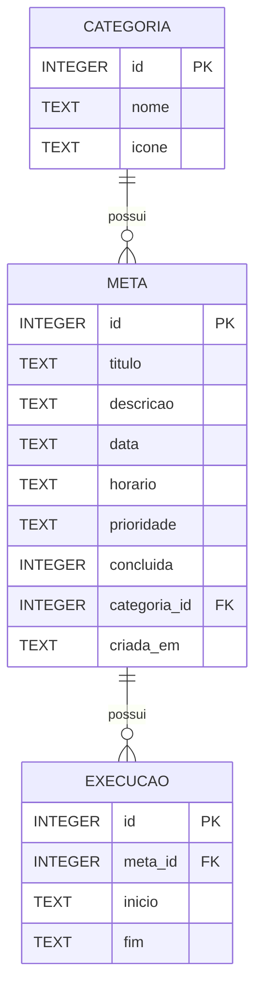

# CanDo

## Sobre o app

O **CanDo** é um aplicativo mobile de organização de tarefas diárias. O usuário pode cadastrar as tarefas que deseja realizar, organizá-las por categoria e prioridade e acompanhar seu progresso ao longo do dia.

A proposta do aplicativo é oferecer uma experiência simples e intuitiva para ajudar o usuário a visualizar suas atividades, controlar o que já foi realizado e acompanhar seu desempenho diário.

### Funcionalidades essenciais

* [ ] Criar tarefa
* [ ] Listar e visualizar tarefas
* [ ] Editar tarefa
* [ ] Marcar tarefa como concluída
* [ ] Excluir tarefa
* [ ] Definir categoria para a tarefa
* [ ] Definir prioridade da tarefa
* [ ] Definir data e horário para a tarefa
* [ ] Visualizar o progresso diário

### Funcionalidades adicionais (trabalhos futuros)

* [ ] Histórico detalhado de tarefas concluídas
* [ ] Notificações e lembretes
* [ ] Personalização das categorias
* [ ] Tema escuro
* [ ] Estatísticas mais detalhadas de produtividade

## Protótipos de tela

Os protótipos do **CanDo** foram desenvolvidos no Figma, seguindo um Design System próprio, com definição de cores, tipografia, espaçamentos, componentes e estados da interface.

[Protótipos - CanDo (Figma)](https://www.figma.com/design/LBz7bRwmiWOFjMUBxhAk5m/CanDo?node-id=0-1&t=MYgJB43Y0SSDIezh-1)

### Principais telas

* Splash Screen
* Tela inicial / Hoje
* Criar tarefa
* Editar tarefa
* Detalhes da tarefa
* Todas as tarefas
* Progresso
* Perfil / Configurações
* Estado vazio

### Fluxo principal

```text
Splash
   ↓
Hoje
   ↓
Nova tarefa
   ↓
Preencher tarefa
   ↓
Adicionar tarefa
   ↓
Tarefa aparece na lista
   ↓
Detalhes da tarefa
   ↓
Marcar como concluída
   ↓
Progresso atualizado
```

Também estão previstos os fluxos de edição e exclusão:

```text
Hoje
  ↓
Selecionar tarefa
  ↓
Editar
  ↓
Salvar alterações
```

```text
Hoje
  ↓
Selecionar tarefa
  ↓
Excluir
  ↓
Confirmar exclusão
  ↓
Tarefa removida
```

## Modelagem do banco

O aplicativo utilizará um banco de dados local **SQLite** para armazenar as tarefas, categorias e informações relacionadas à execução das tarefas.

A modelagem foi estruturada para permitir o funcionamento das funcionalidades principais do aplicativo e também possibilitar a implementação futura de recursos relacionados ao histórico e ao acompanhamento do progresso.

### Relacionamentos

* Uma **CATEGORIA** pode possuir várias **METAS**.
* Uma **META** pertence a uma **CATEGORIA**.
* Uma **META** pode possuir várias **EXECUÇÕES**.
* Uma **EXECUÇÃO** pertence a uma **META**.

### Tabela `CATEGORIA`

Armazena as categorias utilizadas para organizar as tarefas.

| Campo   | Tipo       | Descrição                   |
| ------- | ---------- | --------------------------- |
| `id`    | INTEGER PK | Identificador da categoria  |
| `nome`  | TEXT       | Nome da categoria           |
| `icone` | TEXT       | Ícone associado à categoria |

### Tabela `META`

Armazena as tarefas cadastradas pelo usuário.

| Campo          | Tipo       | Descrição                               |
| -------------- | ---------- | --------------------------------------- |
| `id`           | INTEGER PK | Identificador da tarefa                 |
| `titulo`       | TEXT       | Nome da tarefa                          |
| `descricao`    | TEXT       | Descrição ou detalhes da tarefa         |
| `data`         | TEXT       | Data em que a tarefa deve ser realizada |
| `horario`      | TEXT       | Horário opcional da tarefa              |
| `prioridade`   | TEXT       | Prioridade: baixa, média ou alta        |
| `concluida`    | INTEGER    | 0 para pendente e 1 para concluída      |
| `categoria_id` | INTEGER FK | Referência para a categoria             |
| `criada_em`    | TEXT       | Data e horário de criação               |

### Tabela `EXECUCAO`

Armazena informações relacionadas à execução de uma tarefa, permitindo futuramente utilizar esses dados no histórico e no acompanhamento do progresso.

| Campo     | Tipo       | Descrição                 |
| --------- | ---------- | ------------------------- |
| `id`      | INTEGER PK | Identificador da execução |
| `meta_id` | INTEGER FK | Referência para a tarefa  |
| `inicio`  | TEXT       | Data e horário de início  |
| `fim`     | TEXT       | Data e horário de término |

### Diagrama ER



### Implementação

O banco será implementado utilizando **SQLite**, permitindo que os dados das tarefas sejam armazenados localmente no dispositivo.

Os campos booleanos, como o status de conclusão da tarefa, serão representados por valores inteiros:

* `0` → tarefa pendente
* `1` → tarefa concluída

As datas e horários serão armazenados como `TEXT`, utilizando um formato padronizado.

## Planejamento de sprints

O desenvolvimento do **CanDo** será dividido em 8 sprints, considerando a evolução do projeto desde a etapa atual do checkpoint até a versão final.

As atividades de planejamento, prototipação e modelagem apresentadas no checkpoint serão consideradas como **já realizadas**. As próximas sprints serão direcionadas principalmente para implementação, integração, testes e finalização do aplicativo.

### Sprint 1 — Estrutura inicial do projeto

**Duração:** 1 semana

* [ ] Criar/configurar o projeto utilizando Expo
* [ ] Configurar React Native e TypeScript
* [ ] Organizar a estrutura de pastas
* [ ] Configurar navegação entre as telas
* [ ] Criar componentes básicos reutilizáveis
* [ ] Configurar o repositório GitHub
* [ ] Implementar o Design System definido no Figma

**Resultado esperado:** estrutura inicial do aplicativo configurada e preparada para o desenvolvimento das funcionalidades.

### Sprint 2 — Tela inicial e componentes

**Duração:** 1 semana

* [ ] Implementar a tela inicial
* [ ] Implementar o cabeçalho e data atual
* [ ] Criar o componente de tarefa
* [ ] Criar componente de checkbox
* [ ] Criar badges de categoria e prioridade
* [ ] Implementar barra de progresso diária
* [ ] Implementar estado vazio
* [ ] Implementar botão de criação de tarefa

**Resultado esperado:** tela inicial funcional e visualmente consistente com o protótipo.

### Sprint 3 — Criação e visualização de tarefas

**Duração:** 1 semana

* [ ] Implementar tela de criação de tarefa
* [ ] Criar formulário de tarefa
* [ ] Implementar seleção de categoria
* [ ] Implementar seleção de prioridade
* [ ] Implementar data e horário
* [ ] Validar os campos obrigatórios
* [ ] Implementar cadastro de tarefas
* [ ] Exibir novas tarefas na tela inicial
* [ ] Implementar tela de detalhes da tarefa

**Resultado esperado:** usuário consegue criar uma tarefa e visualizar seus detalhes.

### Sprint 4 — Gerenciamento das tarefas

**Duração:** 1 semana

* [ ] Implementar edição de tarefas
* [ ] Implementar exclusão de tarefas
* [ ] Criar modal de confirmação de exclusão
* [ ] Implementar conclusão de tarefas
* [ ] Atualizar visual do card após conclusão
* [ ] Atualizar contador de tarefas concluídas
* [ ] Atualizar progresso diário

**Resultado esperado:** gerenciamento completo das tarefas através das operações de criação, visualização, edição, conclusão e exclusão.

### Sprint 5 — Banco de dados SQLite

**Duração:** 1 semana

* [ ] Configurar SQLite no projeto
* [ ] Criar tabela `CATEGORIA`
* [ ] Criar tabela `META`
* [ ] Criar tabela `EXECUCAO`
* [ ] Implementar relacionamento entre as tabelas
* [ ] Implementar inserção de dados
* [ ] Implementar consulta de dados
* [ ] Implementar atualização de dados
* [ ] Implementar exclusão de dados
* [ ] Testar persistência dos dados

**Resultado esperado:** aplicativo integrado ao SQLite, com armazenamento local e persistência das informações.

### Sprint 6 — Tarefas, filtros e progresso

**Duração:** 1 semana

* [ ] Implementar tela de todas as tarefas
* [ ] Implementar filtro por status
* [ ] Implementar filtro por categoria
* [ ] Implementar busca por tarefa
* [ ] Implementar tela de progresso
* [ ] Calcular tarefas concluídas e pendentes
* [ ] Implementar histórico básico de execução
* [ ] Integrar os dados do banco à tela de progresso

**Resultado esperado:** usuário consegue consultar suas tarefas e acompanhar seu progresso.

### Sprint 7 — Testes e ajustes

**Duração:** 1 semana

* [ ] Testar criação de tarefas
* [ ] Testar edição de tarefas
* [ ] Testar exclusão de tarefas
* [ ] Testar conclusão de tarefas
* [ ] Testar categorias
* [ ] Testar prioridades
* [ ] Testar filtros
* [ ] Testar persistência do SQLite
* [ ] Testar navegação entre telas
* [ ] Testar diferentes tamanhos de tela
* [ ] Corrigir bugs
* [ ] Realizar ajustes de usabilidade

**Resultado esperado:** aplicativo funcionando de forma estável e com os principais problemas corrigidos.

### Sprint 8 — Finalização e entrega

**Duração:** 1 semana

* [ ] Realizar testes finais
* [ ] Revisar a interface
* [ ] Comparar as telas implementadas com os protótipos do Figma
* [ ] Corrigir inconsistências visuais
* [ ] Atualizar a checklist de funcionalidades
* [ ] Atualizar o README
* [ ] Revisar a documentação
* [ ] Organizar o código
* [ ] Preparar a versão final do aplicativo
* [ ] Realizar a entrega e apresentação do projeto

**Resultado esperado:** CanDo finalizado, documentado e pronto para apresentação e entrega.
