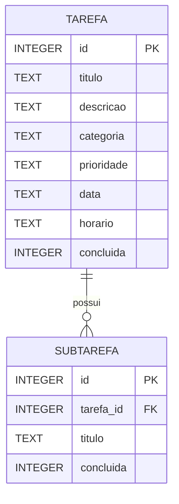

# CanDo

## Sobre o app

O **CanDo** é um aplicativo mobile de organização de tarefas diárias. O usuário pode cadastrar as tarefas que deseja realizar, organizá-las por categoria e prioridade e acompanhar seu progresso ao longo do dia.

A proposta do aplicativo é oferecer uma experiência simples e intuitiva para ajudar o usuário a visualizar suas atividades, controlar o que já foi realizado e dividir tarefas maiores em **subtarefas**, facilitando o acompanhamento do progresso.

### Funcionalidades essenciais

* [x] Criar tarefa
* [x] Listar e visualizar tarefas
* [x] Marcar tarefa como concluída
* [x] Definir categoria para a tarefa
* [x] Definir prioridade da tarefa
* [x] Criar subtarefas dentro de uma tarefa
* [x] Marcar subtarefas como concluídas
* [x] Visualizar o progresso diário
* [x] Visualizar o progresso das subtarefas
* [ ] Persistir tarefas e subtarefas no banco de dados (SQLite)
* [ ] Editar tarefa
* [ ] Excluir tarefa
* [ ] Definir data e horário para a tarefa
* [ ] Validar os campos dos formulários

### Funcionalidades adicionais (trabalhos futuros)

* [ ] Telas não essenciais do protótipo (Todas as tarefas, Progresso, Perfil, Login e Cadastro)
* [ ] Histórico detalhado de tarefas concluídas
* [ ] Notificações e lembretes
* [ ] Personalização das categorias
* [ ] Tema escuro

## Protótipos de tela

Os protótipos do **CanDo** foram desenvolvidos no Figma, seguindo um Design System próprio, com definição de cores, tipografia, espaçamentos, componentes e estados da interface.

[Protótipos - CanDo (Figma)](https://www.figma.com/design/LBz7bRwmiWOFjMUBxhAk5m/CanDo?node-id=0-1&t=MYgJB43Y0SSDIezh-1)

### Telas essenciais

Telas necessárias para o funcionamento do app (cadastrar, visualizar, editar e acompanhar tarefas):

* [x] Hoje (`app/index.tsx`)
* [x] Hoje: estado vazio (componente `EmptyState`)
* [x] Nova tarefa (`app/new-task.tsx`)
* [x] Detalhes da tarefa (`app/task-details.tsx`)
* [ ] Editar tarefa

### Telas não essenciais

Telas do protótipo que complementam a experiência, mas o app funciona sem elas:

* [ ] Splash Screen
* [ ] Todas as tarefas
* [ ] Progresso
* [ ] Perfil / Configurações
* [ ] Login
* [ ] Cadastro

### Fluxo principal

```text
Hoje
   ↓
Nova tarefa
   ↓
Preencher tarefa (e subtarefas, opcional)
   ↓
Adicionar tarefa
   ↓
Tarefa aparece na lista
   ↓
Detalhes da tarefa
   ↓
Marcar tarefa ou subtarefas como concluídas
   ↓
Progresso atualizado
```

## Modelagem do banco de dados (SQLite)

O aplicativo utilizará um banco de dados local **SQLite** (via `expo-sqlite`) para armazenar as tarefas e suas respectivas subtarefas. Não há backend: todos os dados ficam no dispositivo.


```mermaid
erDiagram
    TAREFA ||--o{ SUBTAREFA : possui
    TAREFA {
        INTEGER id PK
        TEXT titulo
        TEXT descricao
        TEXT categoria
        TEXT prioridade
        TEXT data
        TEXT horario
        INTEGER concluida
    }
    SUBTAREFA {
        INTEGER id PK
        INTEGER tarefa_id FK
        TEXT titulo
        INTEGER concluida
    }
```

> No SQLite não existem tipos `DATE` e `BOOLEAN` nativos: datas são guardadas como `TEXT` (formato `AAAA-MM-DD`) e booleanos como `INTEGER` (0 ou 1).

## Atualizações desde o último checkpoint

Foi desenvolvida a base arquitetural e visual do CanDo, com navegação via Expo Router, estilização alinhada ao protótipo do Figma, dados mockados, componentes reutilizáveis e a criação de tokens de tema.


#### Recursos aplicados dos módulos anteriores

* **Expo Router:** navegação entre telas via `Stack` e roteamento em `app/` com `useRouter`.
* **TypeScript:** tipagem do modelo de dados (`Task`, `Subtask`) e das props dos componentes.
* **Google Fonts (Inter):** tipografia do Figma carregada com `@expo-google-fonts/inter`.
* **Expo Vector Icons:** ícones de navegação, status e botões com `Ionicons`.
* **Mocks de dados:** dados fake em `mocks/types.ts` para popular as telas.
* **Theme / Design Tokens:** cores, raios, tamanhos e fontes centralizados em `constants/theme.ts`, aplicados na tela de detalhes.

#### Boas práticas na criação de componentes

* **Responsabilidade Única (SRP):** cada componente tem apenas uma função visual isolada (ex: `TaskCard` para tarefas, `DailyProgressCard` para o progresso, `EmptyState` para estado vazio).
* **Componentes Apresentacionais:** recebem dados e emitem ações via `props` (`onPress`, `onToggleComplete`), sem regra de negócio embutida.
* **Props Tipadas com TypeScript:** uso de `interfaces` em cada componente.
* **Modularidade e Separação de Pastas:** divisão entre rotas (`app/`), componentes (`components/`), tipos (`types/`), dados (`mocks/`), tema (`constants/`) e estilos (`styles/`).
* **Separação de estilos:** os estilos da tela de detalhes foram movidos para `styles/taskDetails.styles.ts`, deixando o arquivo da tela só com lógica e JSX.

## Planejamento de sprints

O desenvolvimento do **CanDo** está planejado em 8 sprints. As sprints 1 a 3 já foram concluídas; o cronograma das demais é:

| Sprint | Período | Duração | Foco |
|---|---|---|---|
| 4 | 21/10 a 30/10 | 1,5 semana | Persistência com SQLite |
| 5 | 02/11 a 08/11 | 1 semana | Editar, excluir e validações |
| 6 | 09/11 a 20/11 | 2 semanas | Telas não essenciais |
| 7 | 23/11 a 29/11 | 1 semana | Testes e build do APK |
| 8 | 30/11 a 04/12 | 1 semana | Finalização e entrega |

### Sprint 1: Planejamento e prototipação (concluída)
* [x] Definir as funcionalidades essenciais do aplicativo
* [x] Definir o fluxo de navegação
* [x] Criar as telas principais no Figma seguindo Design System
* [x] Criar o protótipo interativo
* [x] Revisar a experiência de navegação

### Sprint 2: Estrutura inicial e roteamento (concluída)
* [x] Criar o projeto utilizando Expo e TypeScript
* [x] Configurar o repositório GitHub com branch main e fluxo de PRs
* [x] Configurar o Expo Router com `app/_layout.tsx`
* [x] Configurar tipografia Inter com `@expo-google-fonts/inter`
* [x] Organizar a estrutura de pastas do projeto

### Sprint 3: Composição de telas e componentes reutilizáveis (concluída)
* [x] Desenvolver a tela inicial **Hoje** (`app/index.tsx`)
* [x] Implementar componentes reutilizáveis na pasta `components/`
* [x] Desenvolver a tela **Nova Tarefa** (`app/new-task.tsx`) com formulário e subtarefas
* [x] Desenvolver a tela **Detalhes da Tarefa** (`app/task-details.tsx`) com subtarefas interativas
* [x] Popular as 3 telas com dados mockados (`mocks/types.ts`)
* [x] Implementar navegação funcional de ida e volta entre as 3 telas
* [x] Definir o título (`title`) de cada tela no `Stack.Screen`
* [x] Passar o `id` da tarefa para a tela **Detalhes** pela rota (`useLocalSearchParams`)
* [x] Criar os tokens de tema (`constants/theme.ts`) e aplicá-los na tela de detalhes (`styles/taskDetails.styles.ts`)
* [ ] Aplicar os tokens de tema e mover os estilos das telas **Hoje** e **Nova Tarefa** para `styles/`

### Sprint 4: Persistência com SQLite (21/10 a 30/10, 1,5 semana)
* [ ] Instalar e configurar o `expo-sqlite`
* [ ] Criar as tabelas `TAREFA` e `SUBTAREFA`
* [ ] Criar a camada de acesso ao banco (`database/`) com inserir, listar, atualizar e excluir
* [ ] Conectar a tela **Hoje** ao banco (substituir `MOCK_TASKS`)
* [ ] Conectar a tela **Nova Tarefa** ao banco
* [ ] Passar o `id` da tarefa para a tela **Detalhes** pela rota e carregar os dados do banco
* [ ] Persistir a conclusão de tarefas e subtarefas

### Sprint 5: Editar, excluir e validações (02/11 a 08/11, 1 semana)
* [ ] Criar a tela **Editar Tarefa** reaproveitando o formulário de Nova Tarefa
* [ ] Implementar a exclusão de tarefas (com confirmação)
* [ ] Incluir data e horário no formulário e no banco
* [ ] Validar os campos dos formulários (título obrigatório, subtarefa vazia etc.) com mensagens de erro
* [ ] Atualização reativa da barra de progresso diário

### Sprint 6: Telas não essenciais (09/11 a 20/11, 2 semanas)
* [ ] Desenvolver a tela **Todas as tarefas** (filtro por status)
* [ ] Desenvolver a tela **Progresso**
* [ ] Desenvolver a tela **Splash Screen**
* [ ] Desenvolver a tela **Perfil / Configurações**
* [ ] Desenvolver as telas **Login** e **Cadastro**, se houver tempo
* [ ] Implementar feedback visual (mensagens e estados de carregamento)

### Sprint 7: Testes, build e estabilização (23/11 a 29/11, 1 semana)
* [ ] Testar o fluxo completo de tarefas e subtarefas
* [ ] Testar a persistência dos dados ao reabrir o app
* [ ] Corrigir bugs de layout e navegação
* [ ] Validar com `expo-doctor` e `npx tsc --noEmit`
* [ ] Gerar o APK final com EAS Build
* [ ] Publicar o APK como Release no GitHub

### Sprint 8: Finalização e entrega (30/11 a 04/12, 1 semana)
* [ ] Ajustes finais de interface conforme o protótipo do Figma
* [ ] Atualizar a documentação (marcar tarefas e justificar o que não foi feito)
* [ ] Gerar o card de destaques do app
* [ ] Gravar o vídeo final de apresentação
* [ ] Entregar a versão final do aplicativo

## Tarefas não implementadas e justificativas


## Como executar o projeto

### Pré-requisitos
* Node.js (v18 ou superior)
* npm ou yarn
* Expo Go no celular (opcional)

### Instalação e execução
```bash
# 1. Clone o repositório
git clone https://github.com/larigm/can-do.git

# 2. Acesse a pasta
cd can-do

# 3. Instale as dependências
npm install

# 4. Inicie o servidor
npx expo start
```
* Pressione **`w`** para abrir no navegador web.
* Ou leia o QR Code no app **Expo Go** no celular.